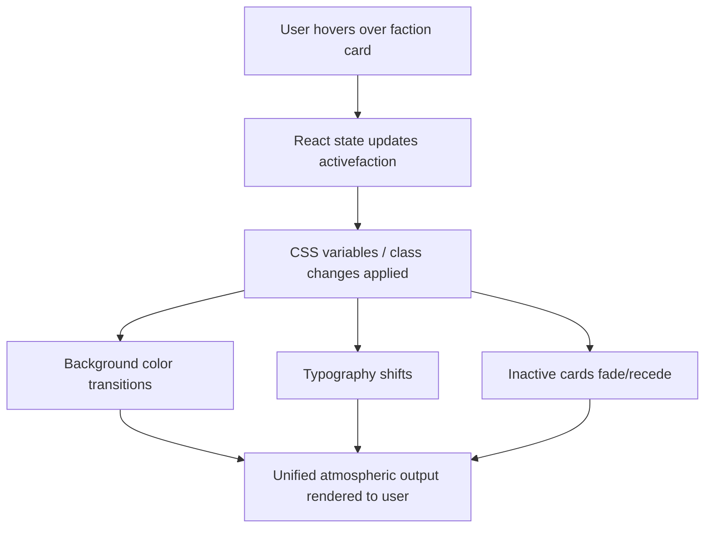

# Hero Faction Screen
**AI 201 — Project 1 | SCAD Atlanta | Spring 2026**

Live URL: https://emihsu0510.github.io/CharacterSelectScreen/

---

## Design Intent

<!-- Written BEFORE AI coding begins. Your own words — do not use AI to write this section.
Include:
- Color palette (specific hex values)
- Typographic hierarchy (font choices, sizes)
- Hover-state behavior (what changes, how, over what duration)
- Mood (one sentence)
- What you will not compromise on
-->

Theme / Concept:

A vibrant digital multiverse where identity is expressed through stylized avatars, blending playful creativity with sleek, futuristic energy. Each faction represents a different emotional aesthetic: bold, soft, or hyper-digital.

Three Factions:

Edgy / Streetwear —
Neon-lit rebels with bold gradients, holographic textures, and expressive avatars. Glowing UI frames, and confident, high-contrast visuals.

Soft / Cottagecore —
Dreamy, pastel-toned characters in a whimsical, cozy world. Rounded UI, soft shadows, plush mascots, and gentle storytelling elements.

Futuristic / Cyber —
Sleek, abstract, and high-tech. Floating geometry, glassmorphism, deep-space gradients, and luminous accents that feel almost alien.

Color Palette
Change from #0B0B12 to something like #C4B5F4 to #E8B8E8 (soft purple to pink gradient)
Streetwear accent: #FF2E9A 
Cottagecore accent: #CBA6F7 
Cyber accent: #5B8CFF 
Text: #F5F5F7 
Typography
Headers: Bold, futuristic sans-serif (e.g. Space Grotesk, Satoshi, Clash Display)
Body: Clean, modern sans-serif (e.g. Inter, SF Pro, DM Sans)
Hover Behavior
Hovered avatar expands slightly with a soft glow halo
Neighboring avatars subtly shrink and dim
Background gradient shifts toward the hovered avatar’s faction color
UI elements gain a slight glassy blur + neon edge highlight

Transition speed: Fast but smooth (snappy with slight easing, ~200–300ms)

Mood in one sentence

Playful yet polished: a dreamy, neon-infused digital playground where personality, emotion, and aesthetic identity come alive.

What will you not compromise on?
The background must always stay within the soft purple palette — no pure black or harsh dark modes

---

## Mermaid Diagram

System flow — what receives input, how the system processes it, what it outputs.

---

## AI Direction Log

3–5 entries documenting what you asked AI to do, what it produced, and what you kept, changed, or rejected — and why.

| # | What I Asked | What AI Produced | My Decision & Why |
|---|---|---|---|
| 1 | Set up a Vite + React project scaffold for a GitHub Pages deployment | Full project structure: `vite.config.js` with correct base path, GitHub Actions deploy workflow, `.gitignore`, `index.html`, `src/` folder with `App.jsx`, `main.jsx`, `index.css` | Kept as-is — the infrastructure matched what was needed. Base path `/CharacterSelectScreen/` correctly targets the GitHub Pages URL. |
| 2 | Build a README with all required assignment sections | README template with Design Intent, Mermaid diagram (pre-filled with system flow), AI Direction Log table, Records of Resistance, Five Questions, and submission checklist | Kept the structure. The Design Intent section remains mine to fill in — AI left it blank intentionally. |
| 3 | Build a quick test page with a button that counts clicks and celebrates each click | Click counter page with escalating celebration messages, press animation, dark background, purple button | Kept it — served its purpose of confirming local dev and hot reload were working before moving to the real design. |
| 4 | | | |
| 5 | | | |

---

## Records of Resistance

Three documented moments where I rejected or significantly revised AI output.

**Moment 1**
- *What AI produced:*
- *Why I rejected/revised it:*
- *What I did instead:*

**Moment 2**
- *What AI produced:*
- *Why I rejected/revised it:*
- *What I did instead:*

**Moment 3**
- *What AI produced:*
- *Why I rejected/revised it:*
- *What I did instead:*

---

## Five Questions Reflection

*Completed before submission.*

1. **Can I defend this?** Can I explain every major decision in this project?
2. **Is this mine?** Does this reflect my creative direction, or did I mostly follow AI's suggestions?
3. **Did I verify?** Did I check that things work the way I think they work?
4. **Would I teach this?** Do I understand it well enough to explain it to someone else?
5. **Is my documentation honest?** Does my AI Direction Log accurately describe what I asked and what I changed?

*Response:*

---

## Submission Checklist

- [ ] Live GitHub Pages URL works in incognito browser
- [ ] Design Intent written (before AI coding)
- [ ] Mermaid diagram accurate and matches built project
- [ ] AI Direction Log has 3–5 entries
- [ ] Records of Resistance has 3 moments documented
- [ ] Five Questions reflection completed
- [ ] GitHub Pages URL submitted to Blackboard
