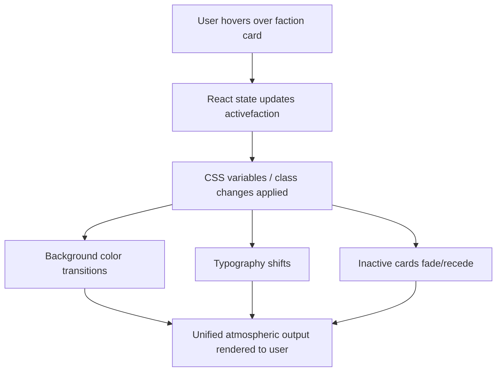

# Hero Faction Screen
**AI 201 — Project 1 | SCAD Atlanta | Spring 2026**

Live URL: https://emihsu0510.github.io/CharacterSelectScreen/

---

## Design Intent

<!-- Written BEFORE AI coding begins. Your own words — do not use AI to write this section.
Include:
- Color palette (specific hex values)
- Typographic hierarchy (font choices, sizes)
- Hover-state behavior (what changes, how, over what duration)
- Mood (one sentence)
- What you will not compromise on
-->

*To be completed.*

---

## Mermaid Diagram

System flow — what receives input, how the system processes it, what it outputs.

---

## AI Direction Log

3–5 entries documenting what you asked AI to do, what it produced, and what you kept, changed, or rejected — and why.

| # | What I Asked | What AI Produced | My Decision & Why |
|---|---|---|---|
| 1 | Set up a Vite + React project scaffold for a GitHub Pages deployment | Full project structure: `vite.config.js` with correct base path, GitHub Actions deploy workflow, `.gitignore`, `index.html`, `src/` folder with `App.jsx`, `main.jsx`, `index.css` | Kept as-is — the infrastructure matched what was needed. Base path `/CharacterSelectScreen/` correctly targets the GitHub Pages URL. |
| 2 | Build a README with all required assignment sections | README template with Design Intent, Mermaid diagram (pre-filled with system flow), AI Direction Log table, Records of Resistance, Five Questions, and submission checklist | Kept the structure. The Design Intent section remains mine to fill in — AI left it blank intentionally. |
| 3 | Build a quick test page with a button that counts clicks and celebrates each click | Click counter page with escalating celebration messages, press animation, dark background, purple button | Kept it — served its purpose of confirming local dev and hot reload were working before moving to the real design. |
| 4 | | | |
| 5 | | | |

---

## Records of Resistance

Three documented moments where I rejected or significantly revised AI output.

**Moment 1**
- *What AI produced:*
- *Why I rejected/revised it:*
- *What I did instead:*

**Moment 2**
- *What AI produced:*
- *Why I rejected/revised it:*
- *What I did instead:*

**Moment 3**
- *What AI produced:*
- *Why I rejected/revised it:*
- *What I did instead:*

---

## Five Questions Reflection

*Completed before submission.*

1. **Can I defend this?** Can I explain every major decision in this project?
2. **Is this mine?** Does this reflect my creative direction, or did I mostly follow AI's suggestions?
3. **Did I verify?** Did I check that things work the way I think they work?
4. **Would I teach this?** Do I understand it well enough to explain it to someone else?
5. **Is my documentation honest?** Does my AI Direction Log accurately describe what I asked and what I changed?

*Response:*

---

## Submission Checklist

- [ ] Live GitHub Pages URL works in incognito browser
- [ ] Design Intent written (before AI coding)
- [ ] Mermaid diagram accurate and matches built project
- [ ] AI Direction Log has 3–5 entries
- [ ] Records of Resistance has 3 moments documented
- [ ] Five Questions reflection completed
- [ ] GitHub Pages URL submitted to Blackboard
