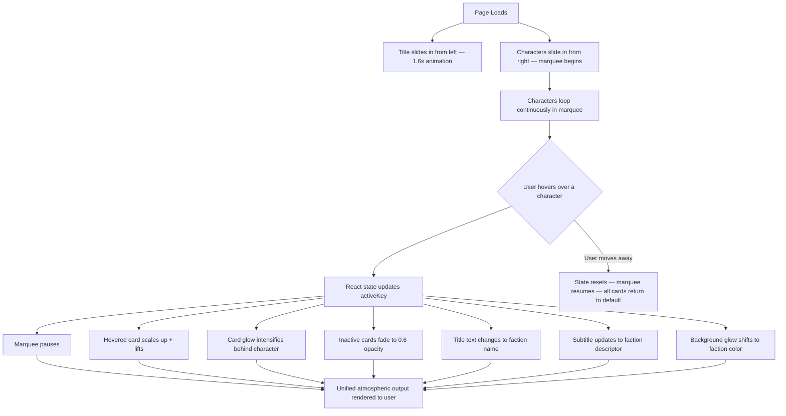

# Hero Faction Screen
**AI 201 — Project 1 | SCAD Atlanta | Spring 2026**

Live URL: https://emihsu0510.github.io/CharacterSelectScreen/

---

## Design Intent

<!-- Written BEFORE AI coding begins. Your own words — do not use AI to write this section.
Include:
- Color palette (specific hex values)
- Typographic hierarchy (font choices, sizes)
- Hover-state behavior (what changes, how, over what duration)
- Mood (one sentence)
- What you will not compromise on
-->

Theme / Concept:

A vibrant digital multiverse where identity is expressed through stylized avatars, blending playful creativity with sleek, futuristic energy. Each faction represents a different emotional aesthetic: bold, soft, or hyper-digital.

Three Factions:

Edgy / Streetwear —
Neon-lit rebels with bold gradients, holographic textures, and expressive avatars. Glowing UI frames, and confident, high-contrast visuals.

Soft / Cottagecore —
Dreamy, pastel-toned characters in a whimsical, cozy world. Rounded UI, soft shadows, plush mascots, and gentle storytelling elements.

Futuristic / Cyber —
Sleek, abstract, and high-tech. Floating geometry, glassmorphism, deep-space gradients, and luminous accents that feel almost alien.

Color Palette
Change from #0B0B12 to something like #C4B5F4 to #E8B8E8 (soft purple to pink gradient)
Streetwear accent: #FF2E9A 
Cottagecore accent: #CBA6F7 
Cyber accent: #5B8CFF 
Text: #F5F5F7 
Typography
Headers: Bold, futuristic sans-serif (e.g. Space Grotesk, Satoshi, Clash Display)
Body: Clean, modern sans-serif (e.g. Inter, SF Pro, DM Sans)
Hover Behavior
Hovered avatar expands slightly with a soft glow halo
Neighboring avatars subtly shrink and dim
Background gradient shifts toward the hovered avatar’s faction color
UI elements gain a slight glassy blur + neon edge highlight

Transition speed: Fast but smooth (snappy with slight easing)

Mood in one sentence

Playful yet polished: a dreamy, neon-infused digital playground where personality, emotion, and aesthetic identity come alive.

What will you not compromise on?
The background must always stay within the soft purple palette — no pure black or harsh dark modes

---

## Mermaid Diagram

System flow — what receives input, how the system processes it, what it outputs.

---

## AI Direction Log

3–5 entries documenting what you asked AI to do, what it produced, and what you kept, changed, or rejected — and why.

| # | What I Asked | What AI Produced | My Decision & Why |
|---|---|---|---|
| 1 | Set up a Vite + React project scaffold for a GitHub Pages deployment | Full project structure: `vite.config.js` with correct base path, GitHub Actions deploy workflow, `.gitignore`, `index.html`, `src/` folder with `App.jsx`, `main.jsx`, `index.css` | Kept as-is — the infrastructure matched what was needed. Base path `/CharacterSelectScreen/` correctly targets the GitHub Pages URL. |
| 2 | Build a README with all required assignment sections | README template with Design Intent, Mermaid diagram (pre-filled with system flow), AI Direction Log table, Records of Resistance, Five Questions, and submission checklist | Kept the structure. The Design Intent section remains mine to fill in — AI left it blank intentionally. |
| 3 | Build a quick test page with a button that counts clicks and celebrates each click | Click counter page with escalating celebration messages, press animation, dark background, purple button | Kept it — served its purpose of confirming local dev and hot reload were working before moving to the real design. |
| 4 | Build a standard card layout | AI generated a standard grid-based card layout with strong hover effects and glowing UI elements | redirected to a horizontal marquee/runway because to better reflect a fashion editorial rather than a game interface. |
| 5 | Experiment with typography and visual tone | AI suggested bold, stylized typography with effects like 3D shadows and heavy drop-shadows | Iterated on multiple tries and ultimately chose a thin, outlined Poppins style. This felt more refined and editorial, aligning with the “Vogue x character creator” direction rather than a loud or overly decorative aesthetic |

---

## Records of Resistance

Three documented moments where I rejected or significantly revised AI output.

**Moment 1** The 360 Turntable
- *What AI produced:* A full 360° rotateY animation on hover that made each character spin like a product showcase.
- *Why I rejected/revised it:*  It felt too “interactive demo” and distracted from the fashion-focused tone. It also made the UI feel more like a game or product viewer rather than an editorial experience.
- *What I did instead:* I removed the rotation entirely and kept the interaction minimal, focusing on subtle scale and presence instead of motion-heavy effects.

**Moment 2** The Shadow
- *What AI produced:* Several CSS shadow variations to ground the characters, including drop-shadows and soft glows.
- *Why I rejected/revised it:* None of the shadows felt natural or stylistically consistent with the clean, floating aesthetic I wanted. They either looked too heavy or too artificial.
- *What I did instead:* I chose to remove shadows completely, allowing the characters to feel more like floating editorial elements rather than grounded objects.

**Moment 3** The Hover Effect
- *What AI produced:* A bright, neon glow hover with strong drop-shadows and a bouncy scaling animation.
- *Why I rejected/revised it:* The effect felt too game-like and energetic, which conflicted with the polished, fashion-oriented direction that I wanted.
- *What I did instead:* I refined the interaction to a softer scale lift with a subtle glow, creating a more controlled and luxurious feel.

---

## Five Questions Reflection

*Completed before submission.*

1. **Can I defend this?** Can I explain every major decision in this project? Yes, I can explain every major decision in this project. I shifted the concept from a customizable avatar game to a fashion editorial experience because the avatars felt more like styled identities than playable characters, which better aligned with the visual direction. This led to more refined interactions and a runway-inspired layout rather than game-like behavior. I also renamed the factions from literal categories (Streetwear, Chic, Cyber, Casual) to NOVA, MUSE, AERA, and VANTA to create a more abstract, brand-like system focused on mood and identity. The final design evolved from what I originally had in the design doc — the background shifted from dark purple to white, and the aesthetic moved toward a fashion editorial direction rather than a game UI.

2. **Is this mine?** Does this reflect my creative direction, or did I mostly follow AI's suggestions? Yes, this project reflects my creative direction. The overall concept, visual style, and design decisions were my own ideas, especially the shift toward a fashion editorial experience and the development of the faction identities. I used AI primarily as a tool for technical support, such as coding and problem-solving. 

3. **Did I verify?** Did I check that things work the way I think they work? Yes, I verified that the project works as intended. I tested interactions like hover states, animations, and layout behavior to ensure they matched my design expectations. I also checked that the application runs correctly both locally and in deployment. 

4. **Would I teach this?** Do I understand it well enough to explain it to someone else? Not yet, this is my first time working on a project like this, and there are still concepts I am learning and don’t fully understand. If I had more time, I really want to go in and flesh out the 3D avatars more and add small animations to them.
   
5. **Is my documentation honest?** Does my AI Direction Log accurately describe what I asked and what I changed? Overall, yes. The AI Direction Log accurately reflects what I asked AI to generate and how I revised or redirected those outputs.

---

## Submission Checklist

- [✅] Live GitHub Pages URL works in incognito browser
- [✅] Design Intent written (before AI coding)
- [✅] Mermaid diagram accurate and matches built project
- [✅] AI Direction Log has 3–5 entries
- [✅] Records of Resistance has 3 moments documented
- [✅] Five Questions reflection completed
- [✅] GitHub Pages URL submitted to Blackboard
